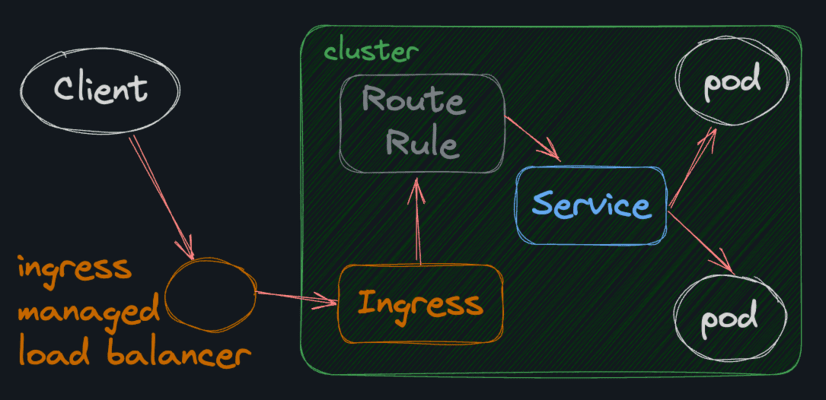

# Making sense of Kubernetes (Credit To Boot.Dev)

1. `Node` is a kubernetes word for computer (can be VM, physical hardware etc)

1. `Pod`: A Pod is the smallest and simplest unit in the Kubernetes object model that you create or deploy. It represents one (or sometimes more) running container(s) in a cluster

1. `Deployment`: You declare the desired "state" in the deployment and kubernetes will make it come true based on that (A Deployment provides declarative updates for Pods and ReplicaSets.)

1. `ReplicaSet`: Maintains a stable set of replica Pods running at any given time. It's the thing that makes sure that the number of Pods you want running is the same as the number of Pods that are actually running. (You will probably never use ReplicaSets directly)

1. `Thrashing Pods`

   Usually caused by:

   - bug in the image

   - misconfigured app

   - dependency of app is misconfigured

   - app using too much memory

1. `CrashLoopBackoff`: Means container is crashing. Kubernetes is all about building self-healing systems, it will automatically restart the container. However, each time it tries to restart the container, if it crashes again, it will wait longer and longer in between restarts. That's why it's called a "backoff".

1. `ConfigMap`: are not cryptographically secure, should use [Kubernetes Secrets](https://kubernetes.io/docs/concepts/configuration/secret/) for sensitive data

1. `Services`: provide a stable endpoint for pods (service will always be available at a given endpoint even if pods is destroyed and recreated), load balances traffic across a group of pods

   Service Type (spec/type)

   - `ClusterIp`: Exposes the Service on a cluster-internal IP. Choosing this value makes the Service only reachable from within the cluster

   - `NodePort`: Exposes the Service on each Node's IP at a static port

   - `LoadBalancer`: Exposes the service externally using a external load balancer (if supported, e.g. AWS, GCP, Azure, or your own)

   - `ExternalName`: Maps the Service to the contents of the externalName field (for example, to the hostname `api.foo.bar.example`). The mapping configures your cluster's DNS server to return a CNAME record with that external hostname value. No proxying of any kind is set up (DNS level redirect, can be used to redirect traffic from one service to another)

   Interesting thing, they are built on top of each other.

   NodePort = ClusterIp + expose service on each node's IP at a statis port

   LoadBalancer = NodePort + external load balancer

   ClusterIp usually go-to, NodePort and LoadBalancer when want to expose a service to the outside world. ExternalName for DNS redirects

1. `Ingress`: exposes services to the outside world.

   

1. It's important to remember that while it's common for a pod to run just a single container, multiple containers can run in a single pod. This is useful when you have containers that need to share resources. In other words, we can scale up the instances of an application either at the container level or at the pod level.

1. `Persistent Volumes`: Instead of simply adding a volume to a deployment, a persistent volume is a cluster-level resource that is created separately from the pod and then attached to the pod. PVs can be created statically or dynamically.

   - Static PVs are created manually by a cluster admin

   - Dynamic PVs are created automatically when a pod requests a volume that doesn't exist yet

   Generally speaking, and especially in the cloud-native world, we want to use dynamic PVs. It's less work and more flexible.

1. `Persistent Volume Claim`: A persistent volume claim is a request for a persistent volume. When using dynamic provisioning, a PVC will automatically create a PV if one doesn't exist that matches the claim.

1. `Namespace`: a way to isolate clusters resources into groups. Names of resources need to be unique within a namespace, but not across namespaces. Namespaces cannot be nested inside one another and each Kubernetes resource can only be in one namespace.

   Kubernetes makes it really easy for pods to communicate with each other. It does this by automatically creating DNS entries for each service. The format is:

   ```
   <service-name>.<namespace>.svc.cluster.local
   ```

   In reality, the .svc.cluster.local isn't needed in most scenarios.

   Unless a service really needs to be made available to the outside world, it's better to keep it internal to the cluster. Internal communications are great because:

   1. It's faster (assuming nodes are close to each other physically)

   1. No public DNS is required

   1. Communication is inherently more secure because it runs on an internal network (usually don't even need HTTPS)

1. `Horizontal Pod Autoscaler (HPA)`: automatically scale the number of Pods in a Deployment based on observed CPU utilization or other custom metrics. It's very common in a Kubernetes environment to have a low number of pods in a deployment, and then scale up the number of pods automatically as CPU usage increases

1. `Node Types`: two types:

   `Control Plane`: The control plane is responsible for managing the cluster. It's where the API server, scheduler, and controller manager live. The control plane used to be called "master nodes", but that term is deprecated now.

   `Worker Nodes`: They're the machines that are actually running our containers.

   Usually concerned with scaling out worker nodes and making sure they're healthy. The control plane is fairly static.

   

1. `Resource requests`: Allows us to tell Kubernetes up front how much resource is required If we try to schedule a new pod with resource requests that exceed the node resource, k8s will gracefully tell us it doesn't have enough resources to do so, or it will use a node in the cluster that has at least the amount of resource available

   General tips:

   - Set memory requests ~10% higher than the average memory usage of your pods

   - Set CPU requests to 50% of the average CPU usage of your pods

   - Set memory limits ~100% higher than the average memory usage of your pods

   - Set CPU limits ~100% higher than the average CPU usage of your pods

   Because:

   - Memory is the scariest resource to run out of. If you run out of CPU, your pods will just slow down. If you run out of memory, your pods will crash. For that reason, it's more important to add a buffer to your memory requests than your CPU requests.

   - Limits should only take effect when a pod is using more resources than it should. Limits are like a safety net. If your limits are constantly being hit, you should either increase them or fix your application code so that it uses fewer resources.

     As such, limits should generally be set higher than requests.

   - Because requests are used to schedule pods, you want to make sure that your requests are high enough that once scheduled, your pods will have the resources, but not so high that you're wasting resources. If you set your requests too high, you'll end up with a situation where you can't schedule pods because k8s thinks it doesn't have enough resources, even though it does.

## Kubectl

1. `kubectl get deployments`: create a deployment, needs `name` and `id of docker image`

    ```sh
    kubectl create deployment {some-deployment-name-web} --image={docker.io/username/some-docker-image:latest}
    ```

1. `kubectl get pods`

    use `-o wide` to get a wide output, including ip address

    ```sh
    kubectl get pods -o wide
    ```

    use `-A` to get everything

1. `kubectl port-forward {pod-name, service/{service-name}} 8080:8080`

1. `kubectl edit deployment {deployment-name}`

1. `kubectl delete pod {pod-name}`

1. `kubectl logs {pod-name}`

        `--all-containers`: If there are mulitple containers running on the same pod and see the logs for all of them

1. `kubectl proxy`: start a proxy server on your local machine

1. `kubectl get {replicasets, svc OR service, pvc, pv, namespace OR ns, hpa}`

1. `kubectl apply -f {configuration}.yaml`

1. `kubectl port-forward service/{service-name} 8080:8080`

1. `kubectl create ns crawler`: create a namespace named crawler

1. `kubectl addons enable {stuff}`

    1. `ingress`: enable the ingress service

    1. `metrics-server`: enable the metrics-server

       1. `kubectl top pod`: see the resource that each pod is using

1. `kubectl describe pods`

1. `kubectl get nodes`

## Minikube

Minikube runs a single node cluster, compared to production kubernetes clusters which are multi-node and distributed

1. `minikube start`

1. `minikube stop`

1. `minikube delete`

1. `minikube dashboard`: Open a browser window with a locally hosted dashboard for your cluster. You can use this dashboard to view and manage your cluster.

1. `minikube tunnel -c`: Tunnel creates a route to services deployed with type LoadBalancer and sets their Ingress to their ClusterIP.

## Setting up local k8 cluster

[Guide](https://medium.com/@saderi/quickly-set-up-a-multi-node-kubernetes-cluster-on-ubuntu-b7544c284b7b)

Extras:

1. If cannot find br_netfilter

   - `sudo modprobe br_netfilter`
   - `lsmod | grep br_netfilter` to verify its loaded
   - `echo "br_netfilter" | sudo tee /etc/modules-load.d/k8s.conf` to persist across reboots

1. To allow a 'worker' to join a control-plane, go to the control plane and run `sudo kubeadm token create --print-join-command` and run the resultant command on the worker node

1. To reset what you ran with `kubeadm init`, run `sudo kubeadm reset`

1. If local use Flannel, if need other stuff use Cilium. Weave is discontinued and Calico should be worse than Cilium

1. `free -h` to check the swap status

### To run kubectl targeting a remote

1. You need to copy out the kubeconfig file. This file is usuall the `$HOME/.kube/config` or the `/etc/kubernetes/admin.conf` assuming you use root. You can use sftp to copy it, locally the kubectl version should be [one minor version difference of your server version](https://kubernetes.io/docs/tasks/tools/install-kubectl-linux/#before-you-begin)

## Yaml stuff, because why not

1. `apiVersion`: apps/v1 - Specifies the version of the Kubernetes API you're using to create the object (e.g., apps/v1 for Deployments).

1. `kind`: Deployment - Specifies the type of object you're configuring

1. `metadata`: Metadata about the deployment, like when it was created, its name, and its ID

   - `kubectl.kubernetes.io/last-applied-configuration`: will not be there if we do `kubectl create deployment`, but will be there after we do `kubectl apply`

   - `annotations` : The core Kubernetes API is intentionally kept small, instead of adding a bunch of new fields to the core API, Kubernetes allows you to add arbitrary annotations to your resources, and then various extensions can read those annotations and do things with them. in most production deployments you'll be using annotations specific to the cloud provider you're using. Each major cloud provider has their own products, so you need to use k8s annotations and extensions specific to that cloud provider.

### Deployments

1. `spec`: The desired state of the deployment. How many replicas you want, will be made here.

   - `replicas`: Amount of replicas

   - `selector/matchLabels/app`: should match `metadata/labels/app`

   - `template/metadata/labels/app`: should match `metadata/labels/app`

   - `containers`: stuff like `name`, `image`, `env` or `envFrom`

     - `env`: stuff like `name`, `valueFrom`

       - `valueFrom/configMapKeyRef`: to specify where to get the value from configmap, includes `name`, `key`

     - `envFrom/configMapRef`: compared to `env`, we don't have to list each env variable one by one

     - `resources`

       - `limits`: stuff like `cpu`, `memory`

1. `status`: The current state of the deployment. You won't edit this directly, it's just for you to see what's going on with your deployment.

### ConfigMap

1. `data`: where you specify any key values

### Services

1. `spec`: stuff like `ports`, `selector/app`

   - `selector/app`: This should match the `metadata/labels/app` in `Deployments`

   - `ports`: stuff like `protocol`

     - `port`: will listen on this port

     - `targetPort`: traffic will be forwarded to this port in the pods

### Ingress

1. `spec`

   - `rules`

     - `host`: specfies the host this rule is for

     - `http`

       - `paths`: like `path` or `pathType`

         - `backend`: specifies the backend this host should resolve to, stuff liek `service.name`, `service.port.number`
